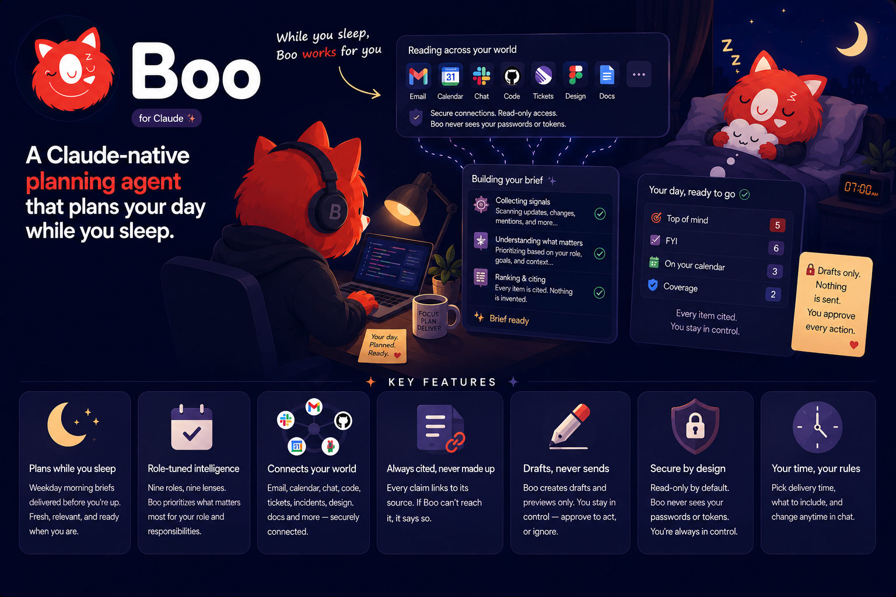

<p align="center">
  
</p>

# Boo for Claude

**A Claude-native planning agent that plans your day while you sleep.** Every weekday morning — before
you're even up — Boo reads across the tools you already use (email, calendar, chat, code, tickets,
incidents, design, docs) and hands you a single **source of truth for your day, tuned to your role**:
what needs your attention, ranked, cited, and ready to act on. Every line links to its source, nothing
is fabricated, and it drafts but never sends.


-informational)

> **Core invariant:** every displayed claim is cited to its source and nothing is invented; Boo creates
> **drafts and previews only** — it never sends, posts, or merges — and scheduled runs never change
> anything. The brief you see is a pure function of a validated, grounded payload.

## Install

This repo **is** a Claude Code plugin marketplace — no backend, no build step. Pick whichever fits:

### Claude apps (desktop / web) — no CLI

**Settings → Plugins → Add marketplace → "Add from a repository"**, then paste the repo:

```
koushikeverything/boo-for-claude
```

<sub>Or the full git URL: `https://github.com/koushikeverything/boo-for-claude.git`.</sub>

Once the marketplace syncs, **install the `boo` plugin** from it and toggle it on — it's now available
in your chats and Cowork.

### Claude Code — two commands

```bash
claude plugin marketplace add koushikeverything/boo-for-claude
claude plugin install boo@boo-marketplace
```

<sub>`owner/repo` clones over SSH by default. No SSH keys? Use the HTTPS URL above. Update later with `claude plugin marketplace update boo-marketplace`; uninstall with `claude plugin uninstall boo`.</sub>

### Other ways

- **claude.ai standalone Skill** — `make package`, then upload `dist/team-brief-skill.zip` in
  **Settings → Skills**.
- **Dev / no install** — `claude --plugin-dir <path-to-your-boo-clone>` (see
  [`docs/SETUP-CLAUDE.md`](docs/SETUP-CLAUDE.md)).

## Getting started (after install)

Boo lives in **Cowork** — Claude's agentic workspace — and works in any chat too. Once the plugin is
enabled:

### 1 · Onboard — say *"set up Boo"*

Open **Cowork** (or a chat) and say **"set up Boo."** Onboarding is a short sequence of tap-to-select
cards — no forms:

- **Pick your role** — one of the nine, or **⚡ Superhuman** to choose your own mix of tools.
- **Connect your tools** — for anything not connected yet, **Boo pops a Connect card right in the
  conversation.** Click it, approve access in the provider's window, and you're back — **you're never
  sent off to a settings page to hunt for connectors.** The final "Authorize" is always your click; Boo
  never sees a password or token.
- **Pick a delivery time** and **what to include** (calendar, urgent email, mentions, tickets,
  incidents…).

Boo saves a reviewable `role-profile.json`. Change it anytime in chat — *"add Linear," "pause GitHub,"
"switch my role to Eng Lead," "move my brief to 7 AM."*

### 2 · Run it on demand

Ask **"what's my day ahead?"** or **"what's my engineering brief?"** Boo reads across your connected
tools and returns the ranked, cited brief. Then dig in:

- *"Why is the CI failure top of mind?"* · *"Show me PR #514."*
- *"Draft the reply to Dana, but show me first."* — drafts only; nothing sends until you approve.

### 3 · Schedule it — the "while you sleep" part

In **Cowork**, create a **scheduled task** with the prompt from
[`prompts/scheduled-team-brief.md`](prompts/scheduled-team-brief.md), set it to weekday mornings, and
**enable the same connectors on the task** (a scheduled task doesn't inherit the ones you toggled in a
chat). Each run arrives as its **own** Cowork session, **read-only** — Boo makes no changes unattended.

> **Boo never sends, posts, or merges on its own.** Any action — a reply, a calendar event — is drafted
> and waits for your explicit "yes."

## What you get

**One brief, tuned to your role.** Every role connects a **work productivity account — Google Workspace
(Gmail, Calendar, Drive) or Microsoft 365 — as the backbone** (email, calendar, docs), then layers on
that role's tools: code, chat, tickets, incidents, design, support. Boo surfaces what matters for *your*
role — the PRs waiting on *your* review, the incident you're on call for, the customer escalation, the
launch decision blocking the team — as a scannable list:

**Top of mind → FYI → On your calendar → coverage**

Every item carries a source you can click, and Boo is honest about anything it couldn't reach.

## Roles

Nine roles, each with its own retrieval focus and ranking:

| Role | Leads with |
|------|-----------|
| Software Engineer | reviews, CI, incidents |
| Engineering Lead | active incidents, stale PRs, sprint risk |
| Product Designer | Figma reviews & comments |
| Design Lead | sign-offs + team design activity |
| Product Manager | blocked decisions, customer signal |
| Head of Product | escalations, launch blockers |
| QA Engineer | reopened bugs, sign-offs, builds |
| Data / Analyst | data requests, metric questions |
| **⚡ Superhuman** | **your own mix** — the top item under each hat you wear |

**⚡ Superhuman** is the many-hats role for founders and generalists: connect *any* combination of
tools and Boo surfaces the single most important thing under each.

## What a brief looks like

Same skeleton for everyone; the content and ranking change by role. *(Sample data.)*

**Software Engineer**

> **🗓 Your day ahead — Friday, Aug 8**
> *Morning, Koushik. Here's your game plan.*
>
> **🧠 Top of mind**
> - **[15 min] Review PR #514 — rate-limit middleware** — requested *your* review 14h ago; 2 approvals still needed. · GitHub · acme/api · `[Open PR]`
> - **[20 min] CI failing on `feat/checkout-v2`** — the e2e job failed on the latest push. · GitHub · acme/api · `[Open run]`
> - **[5 min] Reply to Dana in #growth** — she's blocked on the API contract for checkout. · Slack · #growth
> - **[30 min] GRW-231 due today** — "Instrument checkout funnel," assigned to you. · Linear · GRW · `[Open issue]`
>
> **🔔 FYI · Alerts**
> - **Checkout error rate up 3× (last 2h)** — spike in `TypeError` since the 06:10 deploy. · Sentry · acme-web
>
> **🗓 On your calendar** — **9:30 AM** Growth standup · **2:00 PM** Sprint planning
>
> *Checked GitHub, Slack, Linear, Sentry and Calendar. PagerDuty isn't connected, so on-call isn't included.*

**⚡ Superhuman** — a founder wearing five hats

> **🗓 Your day ahead — Friday, Aug 8**
> *Morning, Alex. You're wearing five hats today — here's the one thing that matters under each.*
>
> **🧠 Top of mind**
> - **[20 min] Customer escalation** — two enterprise trials hit the checkout bug; both flagged churn risk. · Intercom
> - **[10 min] Decision: pricing-page scope** — blocks Thursday's launch. · Linear · LAUNCH · `[Open issue]`
> - **[15 min] Review PR #514** — your review is blocking the release. · GitHub · acme/api · `[Open PR]`
> - **[15 min] Approve onboarding redesign specs** — design is blocked on you. · Figma
> - **[15 min] Investor follow-up** — reply with the updated deck (promised today). · Gmail
>
> **🗓 On your calendar** — **10:00 AM** Investor call · **2:00 PM** All-hands
>
> *Checked Gmail, Slack, GitHub, Linear, Intercom, Figma and Notion — the tools you picked.*

The engineer example lives in
[`skills/team-brief/examples/engineer-brief.md`](skills/team-brief/examples/engineer-brief.md); validated
payloads for **every** role are in [`evals/expected-v2/`](evals/expected-v2/).

## Features

- **Grounded, never invented.** Every claim carries a citation (source + workspace). Missing
  permissions, empty sources, and conflicts are surfaced plainly — Boo prefers omission over guesses.
- **Real deep-links.** Every "Open PR / issue / message / event" is a live permalink; when a source has
  no URL, Boo offers an in-chat action instead of a dead link.
- **Drafts only, never sends.** Replies and calendar changes are **drafts/previews** requiring your
  explicit "yes" — Boo never sends, posts, or merges on its own.
- **Read-only when scheduled.** Unattended morning runs never mutate anything; actions wait for you.
- **Yours only (per-viewer scoping).** Built from tools *you* connected with *your* credentials — it can
  never exceed what you can already see. No org-wide/bot aggregation.
- **Cross-source de-duplication.** A PR discussed in GitHub, Slack, and Linear collapses to one item
  with all three citations.
- **Card-driven setup.** Onboarding is a short sequence of tap-to-select cards: role → connect tools →
  delivery time → sources.
- **Scheduled in Cowork.** Delivered as a scheduled Claude session each weekday — not another email.

## Connectors — one source of truth across your stack

Boo reads through Claude's **native connectors** — no scrapers, no stored data, no new backend. It only
offers tools it can actually connect, and hides the rest. Available today:

| Capability | Connectors |
|-----------|-----------|
| 📥 **Email & Calendar** | Google Workspace · Microsoft 365 |
| 💬 **Team chat** | Slack · Microsoft Teams |
| 💻 **Code & CI** | GitHub · GitLab |
| 🎫 **Issues & projects** | Jira · Linear · Asana |
| 🚨 **Incidents / on-call** | PagerDuty |
| 📈 **Observability** | Sentry · Datadog |
| 🎨 **Design** | Figma |
| 📚 **Docs / knowledge** | Notion · Confluence · Google Docs · SharePoint |
| 🎧 **Customer support** | Intercom |

Your role decides which of these are offered, and which are required vs. optional. **⚡ Superhuman** gets
the full menu to pick from. *Product analytics (Amplitude / Mixpanel / PostHog) is on the roadmap.*

## How it works (in 60 seconds)

```
role + connected tools
   → availability gate      offer only what you can actually connect
   → bounded retrieval      across your tools, your permissions only
   → dedup + conflicts      one real-world thing = one item, merged citations
   → role-aware ranking     explicit order (incidents/decisions first, etc.)
   → validation             schema + semantic rules; every claim must be grounded
   → "Your day ahead"       rendered natively in Claude
```

Presentation is a pure function of a validated payload, so what you see is exactly what passed the
grounding and safety checks. Architecture + diagrams: [`docs/ARCHITECTURE.md`](docs/ARCHITECTURE.md).

## What's in the box

```
boo-for-claude/
├── .claude-plugin/          ← makes this repo an installable plugin marketplace
│   ├── plugin.json
│   └── marketplace.json
├── skills/                  ← 7 Skills (the workflows Claude follows)
│   ├── daily-brief/         ←   Google-Workspace brief (v1) + the shared validator/dedup/date scripts
│   ├── team-brief/          ←   role/team brief — self-contained bundle + per-role packs
│   ├── onboarding/          ←   card-driven first-run setup
│   ├── manage-role-profile/ ←   view/edit/pause/remove your profile
│   └── … brief-details, brief-actions, manage-boo-preferences
├── config/                  ← capability catalog + role matrix (the role model)
├── lib/                     ← gating · ranking · cross-source dedup (stdlib Python)
├── schemas/                 ← brief + role-profile JSON Schemas
├── prompts/                 ← scheduled / manual / onboarding prompts
├── evals/                   ← 36 golden brief payloads + scenario manifests
├── tests/                   ← 123-test suite (stdlib unittest)
├── connector/               ← optional multi-account MCP connector (parked)
├── scripts/                 ← quality gate, packaging, validators
└── docs/                    ← architecture, privacy, threat model, setup, limitations
```

## Tech stack

- **Claude Code plugin** — 7 Skills (Markdown workflows), auto-discovered; installable via the bundled
  **plugin marketplace** or as standalone claude.ai Skill ZIPs.
- **Python 3.9+, standard library only** — no third-party dependencies. The deterministic validator,
  JSON-Schema brief contracts, cross-source dedup, role ranking, and availability gate all run offline.
- **Native Claude connectors** for every source (no scrapers, no stored data): Google/M365, GitHub/
  GitLab, Slack/Teams, Jira/Linear/Asana, PagerDuty, Sentry/Datadog, Figma, Notion, Intercom.
- **Cowork** for scheduled, unattended delivery.
- **Optional multi-account connector** (`connector/`) — a remote **MCP** server in Python with OAuth
  (PKCE + signed state), envelope-encrypted token store (AES-GCM / stdlib HMAC), and SQLite. Built and
  fixtures-tested; **parked** (needs a Google OAuth app + HTTPS host to run live).
- **123 tests** (stdlib `unittest`) + secret scan + offline & official plugin validation, all via
  `make check`.

## Privacy & safety

Read-minimally, cite everything, **drafts only — never send**, explicit approval before any change,
**no mutations during unattended runs**, per-viewer scoping, and source content treated as untrusted
data (it can inform the brief but never issue instructions). Secrets never reach Claude. Full model:
[`docs/PRIVACY.md`](docs/PRIVACY.md) · [`docs/THREAT-MODEL.md`](docs/THREAT-MODEL.md).

## Status & limitations

Shipped and installable (v0.3.0); the build is green and installs cleanly from a fresh clone. Product
analytics (Amplitude/Mixpanel/PostHog) has no connector yet, so that slot is hidden and noted in the
brief. Live multi-connector runs are proven for the engineer/GitHub path; other roles are validated
against golden fixtures and are best exercised once you connect your own tools. Full candor:
[`docs/LIMITATIONS.md`](docs/LIMITATIONS.md).

## Develop

```bash
make check      # full gate: 123 tests + validation + bundle-drift + secret scan + plugin validate
make package    # build the standalone skill ZIPs
make doctor     # flag any connector that will fail on a missing token
```

## Contributing

Issues and PRs welcome. Keep the gate green (`make check`), and hold the one rule that matters:
**every claim must be grounded — cite the source, and draft rather than send.**

## License

[MIT](LICENSE) © 2026 Koushik
