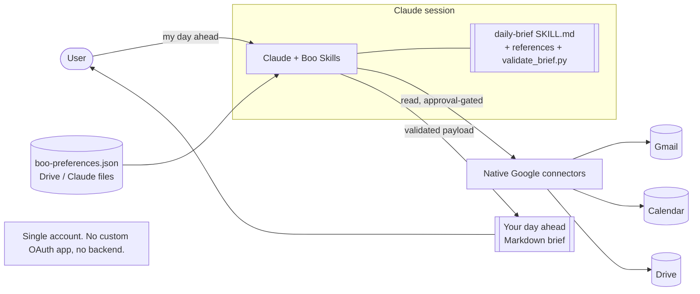
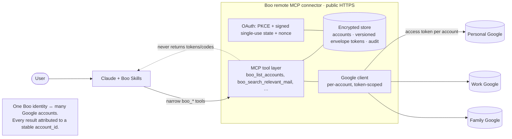
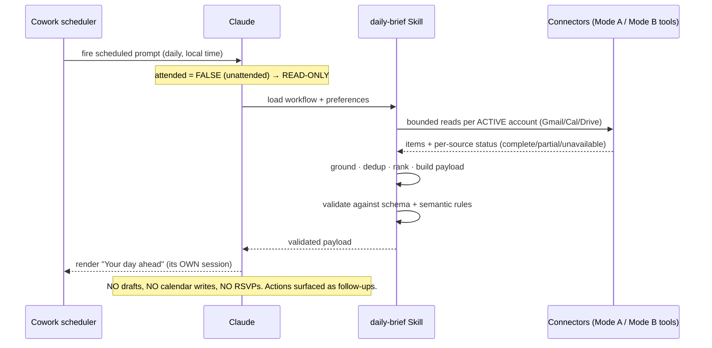
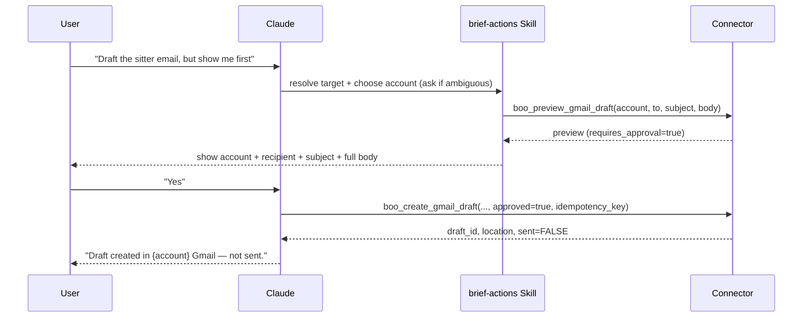
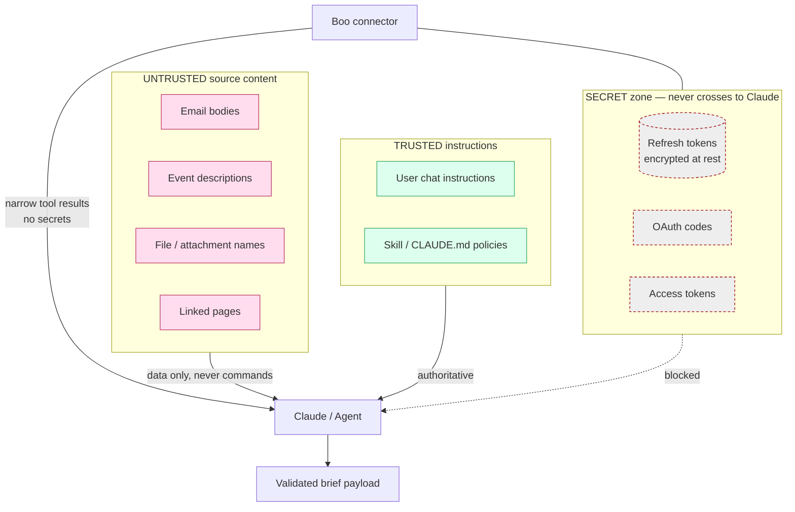
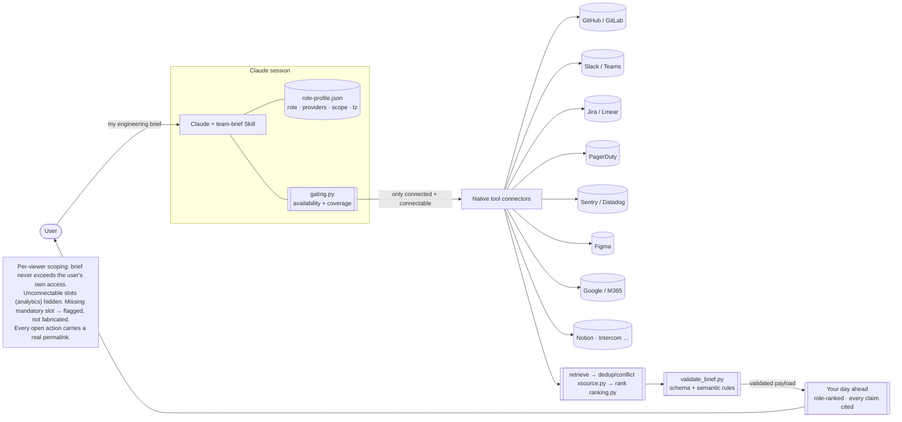
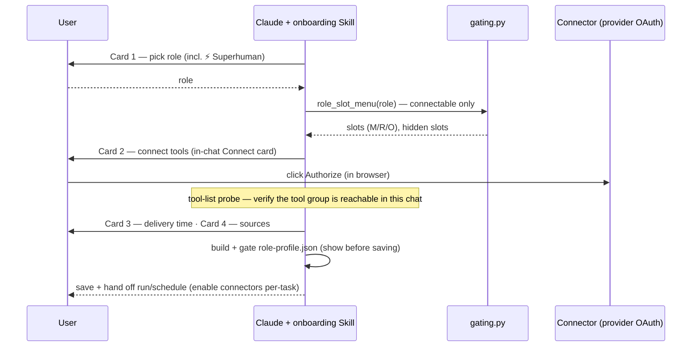

# Architecture

Boo separates **Workflows** (Skills), the **Agent** (Claude), and **Tools** (connectors + scripts).
Sections 1–5 cover the personal brief (native Google — Mode A; the parked multi-account MCP connector
— Mode B). Sections 6–7 cover the **v2 role/team brief** (native-only, per-viewer scoping) and its
card-driven onboarding. Diagrams use Mermaid (renders in most Markdown viewers; readable as text
otherwise).

## 1. Native connector mode (Mode A)

## 2. Multi-account MCP mode (Mode B)

## 3. Scheduled-run sequence

## 4. Follow-up action & confirmation sequence

## 5. Data & trust boundaries

## 6. Role/team brief mode (v2 — Model A, per-viewer scoping)

Native-only. The role selects a requirement profile; the **availability gate** offers only
connectable providers; retrieval runs across the tools the user actually connected (their own
credentials, their own permissions); cross-source dedup/conflict collapses the same real-world thing
seen in several tools; role-aware ranking stamps an explicit `rank`; the same validator + output
contract render the brief. **⚡ Superhuman** is the free-pick role — every non-productivity slot is
optional, so the user connects any mix.

## 7. Card-driven onboarding (Cowork)

Setup is a sequence of **native selection cards** — the user completes it by clicking. Claude coaches
each connection but never authorizes: the final consent is always the user's, in the provider's OAuth
screen.

## Component responsibilities

| Layer | Component | Responsibility |
|-------|-----------|----------------|
| Workflow | `skills/daily-brief` | v1 retrieval, grounding/dedup/rank, output contract, validation |
| Workflow | `skills/brief-details` | Cited follow-ups (read-only) |
| Workflow | `skills/brief-actions` | Preview → approval → single action → verified result (drafts only) |
| Workflow | `skills/manage-boo-preferences` | Personal preferences + account lifecycle |
| Workflow | `skills/team-brief` | v2 role brief — role packs, retrieval/ranking/output policy; self-contained bundle |
| Workflow | `skills/onboarding` | Card-driven first-run: role → tools → time → sources → role-profile.json |
| Workflow | `skills/manage-role-profile` | View/edit/pause/remove the role profile (reversible) |
| Tool | `config/` + `lib/gating.py` | Role model (catalog + matrix), availability gate, coverage note |
| Tool | `lib/ranking.py` · `lib/xsource.py` | Role-aware `rank`; cross-source dedup + conflict detection |
| Agent | Claude | Relevance, extraction, ranking, summarizing; never holds secrets |
| Tool | `connector/boo_connector/crypto` | Versioned envelope encryption of refresh tokens |
| Tool | `connector/boo_connector/google/oauth.py` | PKCE, signed single-use state, request builders |
| Tool | `connector/boo_connector/store` | Accounts, encrypted creds, health, audit, migrations |
| Tool | `connector/boo_connector/tools` | Narrow `boo_*` MCP tools (no raw HTTP/SQL, no token egress) |
| Tool | `skills/daily-brief/scripts` | Deterministic validation, dedup, date handling |

## Schema versioning

The personal brief is `schema_version "1.0"` (`schemas/daily-brief.schema.json`); the role/team brief
is `"2.0"` (`schemas/brief.schema.json`) — a **structural superset** with the same field names (so
`validate_brief.py` is unchanged), a widened `source` enum, and added `role`/`team`/`capability`/
`workspace`/`rank`. See `docs/SCHEMA-MIGRATION-v1-v2.md`. Each standalone skill bundles a byte-identical
copy of its scripts/schemas/config (a gate check enforces no drift) so the claude.ai upload is
self-contained.

## Key data-flow invariants

- Presentation is a **pure function** of the validated payload.
- Source content is **untrusted data**; it can inform the brief but never issue instructions or
  invoke a tool.
- Secrets (refresh/access tokens, OAuth codes, ciphertext) **never** cross into Claude's context.
- Unattended runs are **read-only**; mutations require attended, explicit approval (drafts/preview only).
- **Per-viewer scoping (v2):** the role brief is built only from tools the user connected with their
  own credentials — it never exceeds their own permissions; no service/bot aggregation.
- **Availability gate:** only connectable providers are offered; a slot with no connector (analytics
  today) is hidden, never fabricated.
- **Deep-link invariant:** any item with an `open_source` action carries a real permalink in a
  citation (enforced by `tests/test_acceptance_v2.py`); otherwise it offers a chat-prompt action.
- **Role ranking:** Top of mind is ordered by an explicit `rank` (urgency → role capability-priority
  → effort), honored by the validator.
